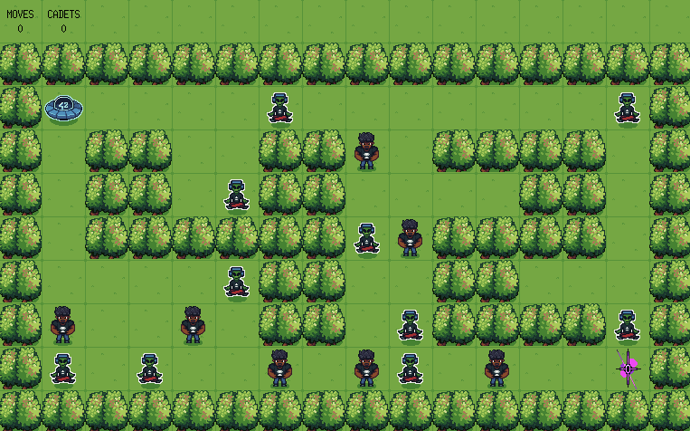

# So Long



## 📚 Descrição

**So Long** é um jogo 2D desenvolvido usando a biblioteca MiniLibX da 42. O jogador controla um personagem que deve coletar todos os itens coletáveis em um mapa antes de poder sair. O projeto demonstra conhecimentos em programação gráfica, gerenciamento de recursos e lógica de jogos.

## 🎯 Objetivos

- Criar um jogo 2D funcional usando MiniLibX
- Implementar sistema de mapas a partir de arquivos `.ber`
- Desenvolver mecânicas de jogo (movimento, coleta, vitória)
- Gerenciar recursos gráficos e memória adequadamente

## 🎮 Mecânicas do Jogo

### Objetivos
- Coletar todos os itens coletáveis (C) no mapa
- Alcançar a saída (E) após coletar todos os itens
- Evitar inimigos (se presente na versão bonus)

### Controles
- `W` / `↑` - Mover para cima
- `S` / `↓` - Mover para baixo
- `A` / `←` - Mover para esquerda
- `D` / `→` - Mover para direita
- `ESC` - Fechar o jogo

### Elementos do Mapa
- `0` - Espaço vazio (caminho)
- `1` - Parede (bloqueio)
- `C` - Coletável (item a ser coletado)
- `E` - Saída (só funciona quando todos os C são coletados)
- `P` - Posição inicial do jogador
- `X` - Inimigo (apenas versão bonus)

## 📦 Estrutura do Projeto

```
so_long/
├── src/                    # Código fonte (versão mandatória)
│   ├── so_long.c
│   ├── ft_check_map.c
│   ├── load_map.c
│   ├── check_path_map.c
│   ├── ft_map_erros.c
│   ├── load_game.c
│   ├── ft_state_game.c
│   └── ft_player_controll.c
├── src_bonus/              # Código fonte (versão bonus)
│   ├── so_long_bonus.c
│   ├── ft_animation_controll_bonus.c
│   ├── ft_collectible_controll_bonus.c
│   ├── ft_enemy_controll_bonus.c
│   └── ...
├── includes/               # Headers (versão mandatória)
├── includes_bonus/         # Headers (versão bonus)
├── maps/                   # Arquivos de mapa (.ber)
├── assets/                 # Sprites e imagens
├── libs/
│   └── libft/             # Biblioteca libft
├── mlx/                    # Biblioteca MiniLibX
└── Makefile
```

## 🛠️ Compilação

```bash
make        # Compila versão mandatória
make bonus  # Compila versão bonus (com animações e inimigos)
make clean  # Remove arquivos objeto
make fclean # Remove executável e objetos
make re     # Recompila tudo
```

**Nota**: Requer bibliotecas X11 no Linux:
```bash
# Ubuntu/Debian
sudo apt-get install libx11-dev libxext-dev

# Fedora
sudo dnf install libX11-devel libXext-devel
```

## 📖 Uso

### Executar o jogo

```bash
./so_long maps/mandatory/map1.ber
```

### Criar seu próprio mapa

Crie um arquivo `.ber` seguindo as regras:
- Deve ser retangular
- Deve ter paredes (`1`) nas bordas
- Deve ter exatamente 1 jogador (`P`)
- Deve ter pelo menos 1 coletável (`C`)
- Deve ter exatamente 1 saída (`E`)
- Deve ter um caminho válido do jogador até a saída passando por todos os coletáveis

### Exemplo de mapa válido

```
1111111111
1P00000001
110C000001
1000000001
1000000C01
1000000001
1C000000E1
1111111111
```

## 🎨 Funcionalidades

### Versão Mandatória
- ✅ Carregamento de mapas a partir de arquivos `.ber`
- ✅ Validação de mapas (formato, elementos obrigatórios)
- ✅ Movimento do jogador
- ✅ Sistema de coleta de itens
- ✅ Contador de movimentos
- ✅ Verificação de caminho válido
- ✅ Condições de vitória

### Versão Bonus
- ✅ Animações de sprites
- ✅ Sistema de inimigos
- ✅ Múltiplos sprites e animações
- ✅ Interface melhorada
- ✅ Efeitos visuais adicionais

## 🔍 Validação de Mapas

O programa valida:
- ✅ Formato retangular
- ✅ Paredes nas bordas
- ✅ Elementos obrigatórios (1 P, 1 E, pelo menos 1 C)
- ✅ Caminho válido (pathfinding)
- ✅ Caracteres válidos apenas
- ✅ Tamanho mínimo do mapa

## 💡 Exemplos de Uso

```bash
# Jogar com mapa padrão
./so_long maps/mandatory/map1.ber

# Jogar com mapa customizado
./so_long meu_mapa.ber

# Versão bonus
make bonus
./so_long maps/bonus/map1.ber
```

## 🎯 Sistema de Pontuação

- O jogo conta cada movimento do jogador
- Exibe o número de movimentos no terminal
- Objetivo: completar com o menor número de movimentos possível

## 📝 Notas Importantes

- **MiniLibX**: Requer biblioteca gráfica X11 (Linux) ou Cocoa (macOS)
- **Assets**: Certifique-se de que os sprites estão na pasta `assets/`
- **Mapas**: Use apenas caracteres válidos: `0`, `1`, `C`, `E`, `P`
- **Caminho**: O algoritmo verifica se existe caminho válido usando pathfinding
- **Memória**: O jogo gerencia sprites e mapas, liberando memória ao fechar

## 🐛 Troubleshooting

**Problema**: Janela não abre
- Verifique se as bibliotecas X11 estão instaladas
- Certifique-se de que o MLX foi compilado corretamente

**Problema**: Sprites não aparecem
- Verifique se os arquivos de imagem estão em `assets/`
- Verifique os caminhos no código

**Problema**: Mapa inválido
- Verifique se tem exatamente 1 P e 1 E
- Verifique se tem pelo menos 1 C
- Verifique se as bordas são paredes
- Verifique se existe caminho válido

## 🏫 42 School

Este projeto é parte do currículo da 42 School e testa conhecimentos em:
- Programação gráfica (MiniLibX)
- Gerenciamento de recursos
- Lógica de jogos
- Validação de dados
- Algoritmos de pathfinding
- Estruturas de dados complexas